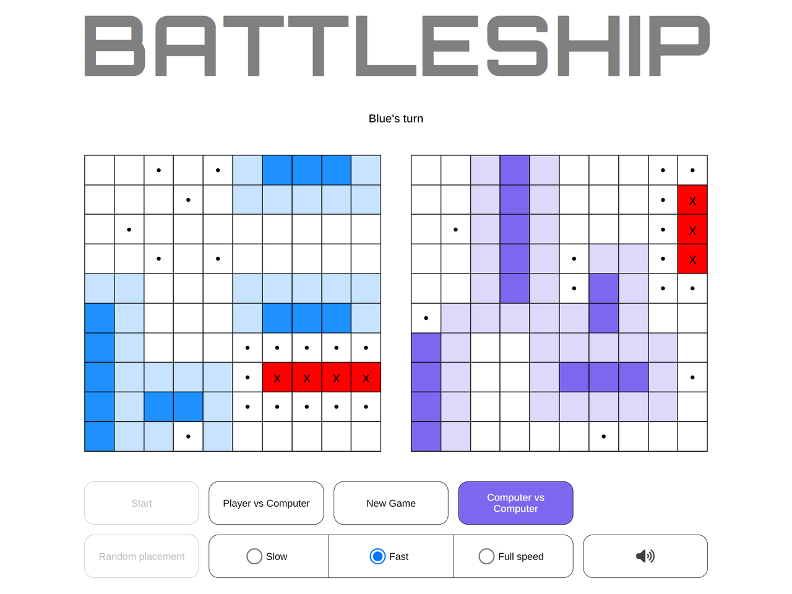

# Battleship

Battleship game with PvP/CvC modes, speed change and laser sounds. CvC mode on full speed with sounds is absolute madness, be sure to check it out! 

[Live Demo](https://mariuszciaston.github.io/Battleship/) :point_left:  

Features: 
• Based on Model–view–controller (MVC) software design pattern 
• Built using test-driven development (TDD), unit tests for gameboard, ship and player included 
• Drag and drop (this one was tough to implement!) 
• Right click to rotate ship 
• Random placement with reserved space around ships 
• Player vs Player mode 
• Computer vs Computer mode (this one is fun) 
• Turn speed changer (Slow = 1s delay, Fast = 100ms, Full speed = 0ms, no delay) 
• 'Bells and whistles' (sounds, animations etc.) 
• Responsive design 

Known problems: 
• Drag and drop doesn't work in Firefox and on mobile (use 'Random placement' button to place ships) 

| 
------------- | 

 
